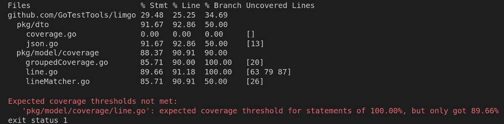

<p align="center">
  
  <h2 align="center">Limgo</h3>
  <p align="center">Don't let your test coverage drop</p>
  <p align="center">
    <a href="https://github.com/GoTestTools/limgo/releases/latest"></a>
    <a href="http://unlicense.org/"></a>
    <a href="https://github.com/GoTestTools/limgo/actions/workflows/test.yml"></a>
    
  </p>
</p>

---

A tool for defining and enforcing test coverage thresholds locally as well as in CI pipelines - similar to the coverage thresholds in JavaScripts popular Testing Framework [Jest](https://jestjs.io/docs/configuration#coveragethreshold-object). 

`limgo` builds on top of the code coverage file generated by `go test` and extends it by providing
- a configuration schema which allows to specify test coverage thresholds
- and a detailed view of the statement/line/branch coverage - from a module level down to every function



## Installation

To get started, install the pre-compiled `limgo` binary either manually or via `go install`. Alternatively, build it directly from source. 

### Manually

The `limgo` binary can be downloaded manually from the [releases section](https://github.com/GoTestTools/limgo/releases). The binaries have no dependencies and should run without any problems on any of the listed operating systems.

### Using `go install`

The `limgo` binary can be installed using `go install`:
```bash
go install github.com/GoTestTools/limgo/cmd/limgo@latest
```

### Building from source

First, clone this repository via
```bash
git clone https://github.com/GoTestTools/limgo.git
```

Then navigate into the `limgo` directory and build the binary: 
```bash
# via make
make build

# or via go directly
go build -o <output-name> cmd/main.go
```

## Usage

The following snippet shows a basic example usage of `limgo`:

```bash
# run tests and generate coverage file
go test ./... -coverprofile=cov.out

# verify that the coverage is not below the thresholds defined in .limgo.json
limgo -coverfile=cov.out -config=.limgo.json -v=3
```

An overview as well as a short description of all supported flags can be displayed via
```bash
limgo -help
```

### Output format

By default, `limgo` will output the statistic and the list of failed coverage thresholds in a tabular format (as seen above). Further, currently implemented, formats include
```bash
# JSON
limgo -coverfile=cov.out -outfmt=json

# Markdown
limgo -coverfile=cov.out -outfmt=md
```

### The configuration file

Coverage thresholds as well as statistic configuration can be defined in a configuration file. By default, `limgo` will search for a file named `.limgo.json`. This can be overridden by the `-config` flag. 

To get started, the most basic configuration - an empty json - can be used:
```json
{}
```
`limgo` will, by default, always exclude the vendor directory from the statistic as well as the coverage threshold evaluation. 

Coverage thresholds can be defined for `statements`, `lines` and `branches`. In the example below, thresholds are defined 
- on a global (project) level
- for all files in the "coverage" directory
- for all files in the "gosrc" directory starting with "g"

Also, the dto directory is excluded from the statistc as well as from the coverage evaluation. 
```json
{
	"coverage": {
		"global": {
            "statements": 50,
            "lines": 55,
            "branches": 33
        },
        "matcher": {
            "pkg/coverage": {
                "statements": 70,
                "lines": 70,
                "branches": 33
            },
            "pkg/gosrc/g.*": {
                "statements": 10,
                "lines": 15,
                "branches": 50
            }
        },
        "excludes": [
            "dto/.*"
        ]
	},
	"statistic": {
		"excludes": [
			"dto/.*"
		]
	}
}
```

Every matchers key is parsed as a [regular expression](https://pkg.go.dev/regexp) and it's threshold is applied to all the files that match it. Within the `excludes` array directories and files can be excluded - this overrides any matches. 

## Setup in a CI system

As `limgo` is a simple binary, it is easy to set it up in any CI system. The following snippet shows an [Github Action](https://github.com/features/actions) example: 

```yaml
jobs:
  test:
    runs-on: ubuntu-latest
    steps:
      - name: checkout repo
        uses: actions/checkout@v2.3.4

      # Checkout your project with git
      - name: Checkout
        uses: actions/checkout@v2

      # Install Go on the VM running the action
      - name: Set up Go
        uses: actions/setup-go@v2
        with:
          go-version: 1.19
      
      # Option 1: 
      # install using go install
      - name: Set up limgo - option 1
        run: go install github.com/GoTestTools/limgo@latest
      
      # Option 2:
      # install via GitHub Action
      - name: Set up limgo - option 2
        uses: GoTestTools/limgo-action@v1.0.1
        with:
          version: "v0.0.3-beta"
          install-only: true

      # Run tests with coverprofile
      - name: Run tests
        run: |
          go test ./... -coverprofile=test.cov
      
      # Pass the coverprofile to limgo for coverage evaluation
      - name: Check test coverage
        run: |
          limgo -covfile=test.cov -v=2
```

The repository [limgo-action-example](https://github.com/GoTestTools/limgo-action-example) contains an example on how to use the `limgo` GitHub Action.  

## Generating a badge

For generating a custom badge that visualizes the test coverage and if it meets the specified thresholds, please refer to the [limgo-badge-action](https://github.com/GoTestTools/limgo-badge-action). 
